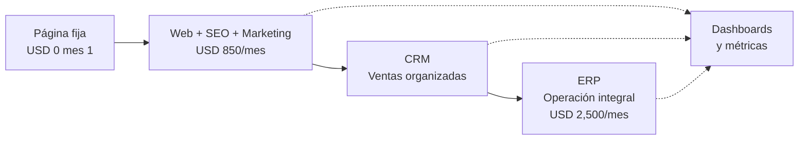

# Grupo Horizonte — Propuesta de plataforma digital

**Presentación para cliente**  
*De la página web de presentación al sistema integral en línea*

---

## 1. Por qué esta conversación

Muchas empresas piden “una página web” pensando que eso solo basta. En realidad existen **varios niveles** de presencia digital, y cada uno resuelve problemas distintos.

Esta presentación explica, en lenguaje claro:

- Qué es una **página web fija** (la que ya tiene en línea como demo)
- Qué es una **página web dinámica orientada a ventas y SEO**
- Qué es un **CRM** y para qué sirve
- Qué es un **ERP** y cómo se conecta con todo lo demás
- Cómo se comunica la empresa con **clientes, proveedores y empleados** desde una sola plataforma
- **Cuánto cuesta**, en qué etapa, y **cómo llegamos paso a paso** hasta el sistema completo

---

## 2. Lo que ya tiene hoy (Etapa 0 — sin costo de arranque)

### Página web fija de presentación

| Característica | Qué significa para usted |
|----------------|--------------------------|
| Se construye **una vez** | Inversión inicial concentrada; pocos cambios después |
| Contenido estable | Quiénes somos, obras, contacto, bolsa de trabajo, cotización |
| Siempre en línea | Su empresa se ve profesional 24/7 |
| Formulario de cotización | Genera **contacto e interés**, no cierra ventas sola |

**Ejemplo activo:** la demo que ya está publicada (`grupo-horizonte`) es el **modelo de producto de entrada**. Con sus datos (logo, textos, fotos, teléfonos, proyectos reales) queda lista para mostrar su marca.

### Valor de regalo en esta etapa

| Concepto | Valor referencia |
|----------|------------------|
| Página web corporativa (sin soporte continuo) | **USD 1,000** — incluido como regalo al iniciar |
| Objetivo | Que **se enamore del resultado visible** antes de pagar la suscripción de crecimiento |

> **Importante:** Esta página **no sustituye** un negocio en línea. Es su **tarjeta de presentación digital** y el primer paso para generar confianza.

---

## 3. Diferencia clave: página fija vs página que vende

```
┌─────────────────────────────────────────────────────────────────┐
│  PÁGINA FIJA          →  "Aquí estamos, contáctenos"            │
│  PÁGINA DINÁMICA+SEO  →  "Le encontramos, le convencemos,       │
│                           le damos seguimiento"                   │
│  CRM                  →  "Sabemos quién es cada prospecto       │
│                           y qué le dijimos"                     │
│  ERP                  →  "Operamos obra, compras, ventas y       │
│                           finanzas en un solo sistema"          │
└─────────────────────────────────────────────────────────────────┘
```

### Página web fija

- Pocos cambios al año  
- Ideal para **credibilidad** y **primer contacto**  
- No compite sola en Google frente a quien invierte en contenido y SEO  

### Página web dinámica (producto de entrada — USD 850/mes)

- Contenido que **se actualiza** (obras nuevas, inventario, noticias, landings)  
- **SEO activo**: aparecer cuando alguien busca en su zona o rubro  
- **Marketing digital**: campañas, métricas, embudos de contacto  
- Formularios y seguimiento (cotizar, WhatsApp, correo)  
- **20 horas semanales** dedicadas a construir y mejorar su presencia web  

**En una frase:** la página fija dice *“existimos”*; la página dinámica dice *“encuéntrennos, confíen y escríbanos”*.

---

## 4. Un concepto que debe quedar claro: tráfico ≠ ventas

Hoy su empresa puede tener **tráfico** (personas que visitan la web) y aun así **cero ventas en línea**. Eso es normal si:

- Aún **no existe un modelo de negocio web** (catálogo, precios, proceso de compra o cotización clara)  
- No hay **productos o servicios empaquetados** para internet  
- No hay **seguimiento comercial** a quien llena el formulario  

### Analogía simple

| Situación | Resultado |
|-----------|-----------|
| Abrir una tienda en la calle sin productos en anaquel | Gente entra, nadie compra |
| Tener web con visitas pero sin oferta clara en línea | Igual: **tráfico sin negocio** |

### Qué haremos en los primeros meses (además de SEO)

1. Definir **qué se puede vender en web** (propiedades, maquinaria, servicios de obra, etc.)  
2. Subir **productos de sus mejores proveedores** o desarrollos propios  
3. Conectar cada contacto del formulario con **acción comercial** (llamada, cotización, visita)  
4. Medir en tableros: visitas → contactos → oportunidades → ventas  

**Mensaje para el cliente:** primero generamos **negocio en línea**; el tráfico y el SEO son el combustible, no el motor completo.

---

## 5. CRM — ¿Qué es y cómo funciona?

**CRM** = *Customer Relationship Management* (gestión de relación con clientes).

### Sirve para

- Registrar **cada prospecto** (formulario web, llamada, feria, referido)  
- Ver en qué etapa está: *nuevo → contactado → cotización → negociación → ganado/perdido*  
- Recordar **quién le habló**, qué pidió y cuándo dar seguimiento  
- No perder oportunidades porque “se nos olvidó”  

### Comunicación dirigida — **clientes**

| Canal | Uso |
|-------|-----|
| Web / formularios | Captura automática al cotizar |
| Correo | Propuestas y seguimiento |
| WhatsApp / SMS | Respuesta rápida (integrable en fases posteriores) |

### Comunicación dirigida — **empleados**

- Tareas de seguimiento asignadas por vendedor o residente  
- Alertas: “contacto sin respuesta en 48 h”  

### Comunicación dirigida — **proveedores** (fase CRM avanzada / ERP)

- Historial de cotizaciones de material  
- Comparativo de proveedores por obra  

> El CRM **no reemplaza** al ERP: organiza **ventas y relaciones**. El ERP organiza **operación y dinero**.

---

## 6. ERP — ¿Qué es y cómo funciona?

**ERP** = *Enterprise Resource Planning* (planeación de recursos de la empresa).

### En construcción / desarrollo inmobiliario suele incluir

| Módulo | Función |
|--------|---------|
| Proyectos / obras | Avance, presupuesto, residentes |
| Compras | Órdenes a proveedores, materiales |
| Inventario / activos | Maquinaria, almacén |
| Ventas | Desarrollos, cotizaciones formalizadas |
| Finanzas | Facturación, cobranza, gastos |
| RH (opcional) | Vacantes, nómina básica |

### Cómo se conecta con la web y el CRM

```
  WEB (capta)  →  CRM (ordena ventas)  →  ERP (ejecuta y factura)
       ↑                                        ↓
       └──────── dashboards y reportes ─────────┘
```

**Plataforma integral (objetivo final):** USD **2,500 / mes**  
Todo en internet: clientes, proveedores, empleados y dirección viendo la misma información.

---

## 7. Productos y precios (resumen ejecutivo)

| Etapa | Qué incluye | Inversión |
|-------|-------------|-----------|
| **0 — Arranque** | Página web fija con sus datos (regalo) | **USD 0** mes 1 (valor referencia página: **USD 1,000**) |
| **1 — Crecimiento** | Web dinámica + SEO activo + marketing + 20 h/semana | **USD 850 / mes** (desde **mes 2**) |
| **2 — Plataforma completa** | Web + CRM + ERP + comunicación integral | **USD 2,500 / mes** (meta a mediano plazo) |

### Detalle producto de entrada (USD 850/mes)

- **20 horas por semana** de trabajo dedicado a su web y marketing digital  
- Actualización de contenidos y catálogo  
- SEO técnico y de contenidos  
- Campañas y mediciones  
- Formularios y embudos (cotización, contacto)  
- Reportes mensuales con dashboards  

### Calendario de cobro sugerido

| Mes | Actividad | Pago |
|-----|-----------|------|
| **Mes 1** | Entrega página fija personalizada + alineación de objetivos | **USD 0** (regalo + enamoramiento del producto) |
| **Mes 2 en adelante** | Suscripción web dinámica + SEO + marketing | **USD 850 / mes** |
| **Mes 12+** (según madurez) | Migración gradual a CRM y ERP | Hacia **USD 2,500 / mes** |

---

## 8. Objetivos — primeros 3 meses (Etapa 1)

### SEO y visibilidad

| Mes | Meta orientativa |
|-----|------------------|
| 1 | Auditoría SEO, corrección técnica, Google Search Console, sitemap |
| 2 | Contenido local (obras, servicios, ubicaciones), palabras clave |
| 3 | Acercarse al **~90%** en análisis SEO en línea (Lighthouse, Search Console, posicionamiento básico) |

> El 90% es una **meta de salud técnica y relevancia**, no garantía de ventas automáticas.

### Negocio en línea (paralelo al SEO)

| Mes | Meta |
|-----|------|
| 1 | Definir oferta web: qué se cotiza, qué se vende, qué solo se muestra |
| 2 | Publicar catálogo inicial (propiedades, maquinaria o servicios) |
| 3 | Primer embudo medido: visitas → formularios → contactos atendidos |

### Dashboards y mediciones

Reportes mensuales con indicadores claros:

- Visitas y origen (Google, redes, directo)  
- Páginas más vistas  
- Formularios enviados (cotizar, contacto, bolsa de trabajo)  
- Tiempo de respuesta comercial  
- Avance SEO (puntuación, indexación, palabras clave)  
- **Ventas atribuidas a web** (aunque al inicio sean pocas — es honesto y esperado)  

---

## 9. Plan de trabajo — de la página actual al ERP

### Fase 0 — Mes 1 (gratis / regalo)

- [ ] Personalizar demo con datos reales del cliente  
- [ ] Publicar en dominio propio o subdominio  
- [ ] Formulario de cotización operativo (contacto / engagement)  
- [ ] Sesión de alineación: qué vendemos en web en 6–12 meses  

**Entregable:** página fija en producción + plan de negocio web.

---

### Fase 1 — Meses 2 a 4 (USD 850/mes · 20 h/semana)

- [ ] Migrar a web dinámica (contenido editable)  
- [ ] SEO activo: técnico, contenidos, local  
- [ ] Marketing: redes, campañas, landings  
- [ ] Catálogo en línea (productos / proveedores destacados)  
- [ ] Dashboard mensual  
- [ ] Proceso manual de seguimiento a leads (pre-CRM)  

**Entregable:** presencia que **busca**, **mide** y **convierte contactos**.

---

### Fase 2 — Meses 5 a 8 (USD 850–1,500/mes según alcance)

- [ ] CRM: pipeline de ventas, historial por cliente  
- [ ] Automatización de correos / recordatorios  
- [ ] Roles: ventas, dirección, marketing  
- [ ] Integración formulario web → CRM automático  

**Entregable:** ningún prospecto se pierde por desorganización.

---

### Fase 3 — Meses 9 a 12+ (hacia USD 2,500/mes)

- [ ] ERP modular: obras, compras, inventario, ventas  
- [ ] Portal o vistas para proveedores (órdenes, entregas)  
- [ ] Comunicación interna: empleados, vacantes, permisos  
- [ ] Tablero ejecutivo único (dirección)  

**Entregable:** **una plataforma en internet** que atiende operación y comercial.

---

## 10. Diagrama de evolución (para el cliente)



---

## 11. Compromisos y expectativas realistas

### Nosotros nos comprometemos a

- Entregar la página de regalo en el **mes 1**  
- Dedicar **20 horas semanales** al producto de USD 850 desde el **mes 2**  
- Reportar avance con **dashboards** claros  
- Trabajar el SEO con meta de **~90%** en análisis al **tercer mes**  
- Acompañar la definición del **negocio en línea**, no solo subir visitas  

### El cliente debe entender que

- **Tráfico no es venta** hasta construir oferta y seguimiento  
- El formulario de cotización es **engagement**, no cotización automática  
- El ERP es la **última etapa**, no el primer gasto  
- La inversión crece con el **valor** que recibe (web → CRM → ERP)  

---

## 12. Cierre — propuesta en una slide

| Pregunta del cliente | Respuesta |
|----------------------|-----------|
| ¿Qué recibo gratis? | Página web fija profesional (valor USD 1,000) |
| ¿Cuándo pago? | Desde el **segundo mes**: USD **850** |
| ¿Qué trabajo incluye? | **20 h/semana** web + SEO + marketing |
| ¿Cuándo vendo en línea? | Cuando definamos catálogo, proceso y seguimiento (meses 1–3) |
| ¿Cuál es el sistema final? | Plataforma web + CRM + ERP: **USD 2,500/mes** |
| ¿Qué pasa en 3 meses? | SEO fuerte + primeros indicadores de negocio web medidos |

---

## 13. Próximo paso

1. Aprobar personalización de la página demo con datos reales  
2. Firmar inicio de suscripción **USD 850** a partir del mes 2  
3. Reunión de kick-off: oferta web, proveedores, prioridades SEO  
4. Entrega de calendario mensual con hitos y dashboards  

---

*Documento preparado para Grupo Horizonte — propuesta comercial y plan de evolución digital.*  
*Versión: 1.0 · Uso: presentación a cliente*
